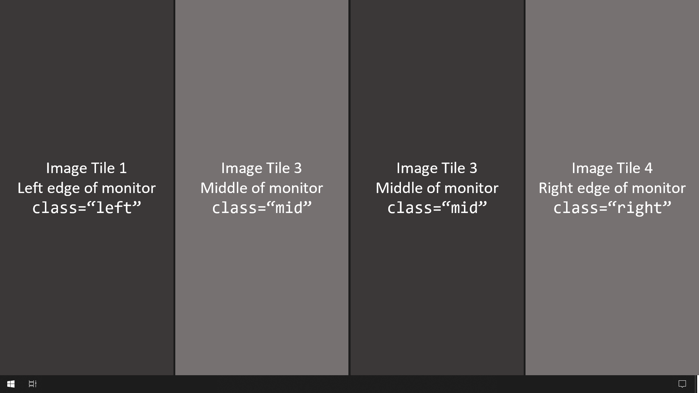

# General Instructions
The webpage is designed to be used in Wallpaper Engine on a single-monitor setup, or widescreen and horizontal multi-monitor setups with equal vertical resolutions. There is an SFW–NSFW toggle to hide the more "spicy" wallpapers when needed (i.e. *work*).

## How to Adapt to Your System
Change the values in the following sections to match your system.

### index.html
1. To reduce or add image tiles, change the number of `div` denoted by "Image Tile #" inside `#background-container` accordingly.
2. Add class `left` for tiles that will be put at the leftmost edge of a monitor, `mid` for middle area, and `right` for rightmost edge. Used for margin purposes.
3. Change the values used in the formula to calculate tile width in [How to adapt to your system - style.css](#stylecss).

Example tile setup on a single monitor. Number of tiles will become 4 and blank spaces will become 3.

### scripts.js
1. `DEFAULT_NSFW`: If the wallpaper will launch as NSFW by default.
2. `safe_pics`: List of the images to cycle through in *safe* mode. Stored in the `images` folder.
3. `unsafe_pics`: List of the images to cycle through in *unsafe* mode. Stored in the `images` folder.

### `images` folder
Create a folder named `images` in the base folder of the repository. All images put in this folder must be resized to the dimensions calculated in the following step. This will create a perfect fit for the tiles.

> TODO: GUI application to resize and automatically perform the above steps.

### style.css
1. `html, body` - `height`: Resize to take account of taskbar at the bottom of the screen
2. `html, body` - `width`: Width of all monitors combined
3. `#background-container > div` - `width`:   Width is calculated using the formula  
    $w = {display\\_width - (tile\\_spacing \times (blank\\_spaces)) \over {num\\_tiles}}$

    
where (in pixels):

    - $w$ : width of the tile
    - $display\\_width$: Combined width of monitors
    - $blank\\_spaces$: Number of blank spaces in between tiles. Equal to 6 if design is unchanged. 
        - 4 tiles each on two monitors
        - 3 blank spaces between each tile, per monitor
        - Physical blank space between tiles at the edges of the two monitors (i.e. between tile 4-5)
    - $tile\\_spacing$: Desired blank space between image tiles
    - $num\\_tiles$: Number of image tiles in the wallpaper
4. `.left`, `.mid`, `.right` - `margin`: Must be `tile_spacing` divided by $2$

## Further Customization
### index.html
1. An image-version template of the button toggle is included in `#buttons-container`, which can be used in place of `#toggle-safe`.
2. To add more content to the left of the toggle button/s, insert the new elements in `#interaction-area`. Any `div` for other monitors should be created in `#foreground-container`.

### scripts.js

Lower is faster cycle for all items listed.

1. `MIN_DELAY_NOCYCLE`: Minimum delay (in *ms*) before retrying to cycle the image if the image <ins>does not</ins> cycle on the previous attempt.
2. `MAX_DELAY_NOCYCLE`: Maximum delay (in *ms*) before retrying to cycle the image if the image <ins>does not</ins> cycle on the previous attempt.
3. `MIN_DELAY_CYCLE`: Minimum delay (in *ms*) before retrying to cycle the image if the image <ins>does</ins> cycle on the previous attempt.
4. `MAX_DELAY_CYCLE`: Maximum delay (in *ms*) before retrying to cycle the image if the image <ins>does</ins> cycle on the previous attempt.